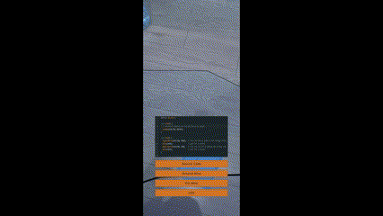

ARduinoSimulation is a mobile application developed as a school project that leverages ARCore and Unity to create an augmented reality (AR) simulation of a basic Arduino circuit. The simulation includes one LED, one Arduino board, and two wires. Users can interact with the circuit by connecting and disconnecting wires, which affects whether the LED blinks based on the current configuration. The source code running on the Arduino is also viewable within the app, allowing users to see how the logic behind the circuit operates.

## Video Presentation



## Features

- **Augmented Reality Simulation**: Experience a simple Arduino circuit in AR using your mobile device.
- **Interactive Circuit**: Connect and disconnect wires to control the LED. The LED will blink when both wires are correctly connected.
- **View Arduino Source Code**: Inspect the source code running on the Arduino directly within the app.
- **Realistic Circuit Behavior**: The LED behavior is simulated based on the connections you make, providing a hands-on learning experience.

## Getting Started

To get started with ARduinoSimulation, follow these steps:

### Prerequisites

- **Unity**: You need Unity installed on your development machine to build and run this project. Download Unity [here](https://unity.com/).
- **ARCore Supported Device**: A mobile device that supports ARCore is required to run the app. The device should have USB Debugging enabled.

### Installation

1. **Clone the Repository**:
   ```bash
   git clone https://github.com/tbtiberiu/ARduinoSimulation.git
   ```
2. **Open the Project in Unity**:
   - Launch Unity and select the `Open Project` option.
   - Navigate to the cloned repository folder and open it.
3. **Build and Run**:
   - Set up your project for Android or iOS build according to your device.
   - Click on `File > Build Settings`, choose your platform, and hit the `Build and Run` button.

### Usage

Once the app is running on your mobile device:

1. Point your camera at a flat surface to initialize the AR environment.
2. The application will detect flat surfaces where you can place a simulated Arduino circuit with an LED and two wires.
3. Tap on the buttons to toggle the wires on and off.
4. Observe how the LED blinks based on the connections you make.
5. You can view the Arduino source code by selecting the code view option within the app.
